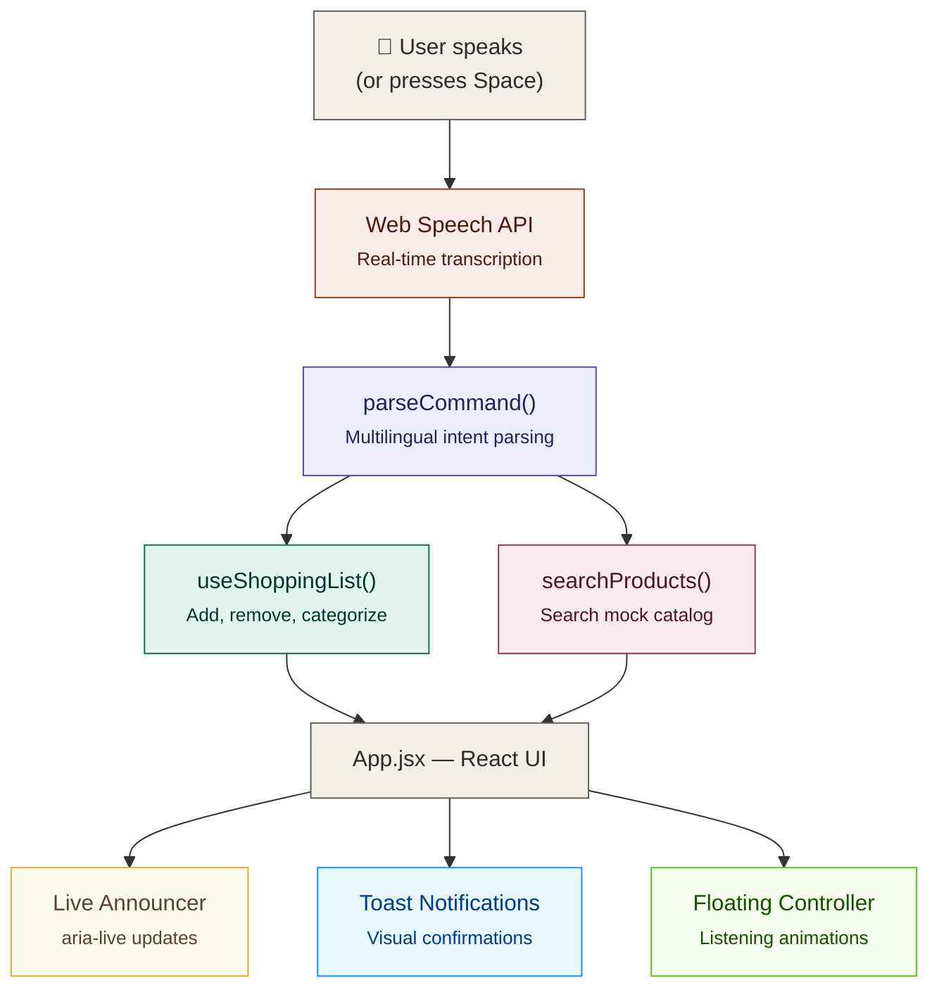

# 🛒 Voice Shopping Assistant

A voice-controlled shopping list manager with smart, rule-based suggestions — built as a scoped technical assessment within an 8–12 hour time budget.

**🔗 Live App:** [https://voice-shopping-assistant-blush.vercel.app/](https://voice-shopping-assistant-blush.vercel.app/)
**📦 Repo:** [https://github.com/AbhyanandSharma2005/voice-shopping-assistant](https://github.com/AbhyanandSharma2005/voice-shopping-assistant)

> Best experienced in **Chrome desktop or Chrome for Android** — see [Browser Support](#browser-support) below.

---

## Table of Contents

- [What This Is](#what-this-is)
- [Features](#features)
- [Tech Stack](#tech-stack)
- [How It Works](#how-it-works)
- [Project Structure](#project-structure)
- [Running Locally](#running-locally)
- [Try These Commands](#try-these-commands)
- [Browser Support](#browser-support)
- [Known Limitations & Design Decisions](#known-limitations--design-decisions)
- [What I'd Add With More Time](#what-id-add-with-more-time)

---

## What This Is

A mobile-first, voice-first shopping list app: speak a command, it's parsed into an intent, and your list updates in real time — with categorization, substitute suggestions, seasonal picks, and voice-activated product search layered on top. 

This was built end-to-end in a single sitting against a fixed time budget. Every simplification below is a **deliberate scope decision**, not an oversight — full reasoning is in [Known Limitations](#known-limitations--design-decisions).

## Features

| Area | What's implemented |
|---|---|
| **Voice input** | Real browser speech-to-text (Web Speech API) — no external API keys needed. |
| **NLP / intent parsing** | Rule-based parser recognizing add, remove, search, clear, and list commands across varied phrasings ("add milk", "I need apples", "I want to buy bananas"). |
| **Multilingual** | Speech recognition **and** command parsing work in English, Hindi, हिंदी, Spanish, and French — switchable via a language dropdown. |
| **Quantity parsing** | Handles both digits ("2 bottles of water") and number words ("add three tomatoes"). |
| **Smart Suggestions** | Prompts alternatives for certain items (substitutes), static seasonal chips, and simulated "You usually buy" staples. |
| **Voice-activated search** | Search a 35-item mock product catalog by name, brand, or category, with "under $X" price filtering. |
| **Enterprise Accessibility (a11y)** | Polite `aria-live` screen-reader announcements, global keyboard hotkeys (`Space` / `Alt+M` to toggle mic), semantic tags, and WCAG-compliant contrast. |
| **Mobile-First UX** | Floating thumb-reachable microphone controller, 44×44px minimum touch targets, real-time live transcript pills, and pulsating active-listening animations. |
| **Visual Feedback** | Integrated `react-hot-toast` for elegant, non-intrusive success/error notifications. |
| **Error handling** | Graceful fallback messages for mic permission denial, no speech detected, network errors, and unrecognized commands — the app never crashes on bad input. |

## Tech Stack

| Layer | Choice | Why |
|---|---|---|
| **Frontend** | React 18 (Vite) | Fast dev loop, no backend needed for this scope. |
| **Voice I/O** | Web Speech API | Native, free, zero API keys. |
| **NLP** | Custom rule-based intent parser | Deterministic, fast, fully offline-capable — chosen over a hosted NLP service for reliability within the time budget. |
| **Styling & UI** | Tailwind CSS v4, React Hot Toast | Rapid, consistent, mobile-first by default with polished notification systems. |
| **State** | React hooks (`useState`) | No backend/database in scope — see limitations. |
| **Hosting** | Vercel | One-command deploy, automatic HTTPS (required for mic access), zero-config for Vite. |

## How It Works



The parser is language-aware: each supported locale (`en-US`, `hi-IN`, `es-ES`, `fr-FR`) has its own keyword dictionary for recognizing add/remove/search/clear/list verbs, so both **speech-to-text and command understanding** work across languages — not just transcription.

## Project Structure

```
src/
├── App.jsx                    # Main UI + orchestration & keyboard listeners
├── components/
│   ├── VoiceController.jsx    # Floating mobile mic + live transcript pill
│   ├── CategorizedList.jsx    # Semantic accessible list rendering
│   └── SuggestionChips.jsx    # Smart recommendations (substitutes, seasonal)
├── hooks/
│   ├── useSpeechRecognition.js # Web Speech API wrapper
│   └── useShoppingList.js     # List state + command dispatcher
├── utils/
│   ├── parseCommand.js        # Multilingual intent parser
│   ├── categories.js          # Item → category lookup
│   ├── suggestions.js         # Substitutes, seasonal, "usually buy"
│   └── searchProducts.js      # Mock catalog search + price filter
└── data/
    └── products.js            # Mock product catalog (35 items)
```

## Running Locally

```bash
git clone [https://github.com/AbhyanandSharma2005/voice-shopping-assistant.git](https://github.com/AbhyanandSharma2005/voice-shopping-assistant.git)
cd voice-shopping-assistant
npm install
npm run dev
```

Open the printed `localhost` URL in **Chrome** and allow microphone access when prompted.

## Try These Commands

| Say this | What happens |
|---|---|
| "Add milk" | Adds milk under Dairy, offers almond/oat/soy milk as alternatives |
| "I need 2 bottles of water" | Adds water, quantity 2, under Beverages |
| "Remove milk" | Removes it, with a friendly message if it's not on the list |
| "Find toothpaste under $5" | Searches the mock catalog, filters by price |
| "Clear my list" | Empties the list |
| "What's on my list" | Confirms current list is showing |

Switch the language dropdown to Hindi, Spanish, or French and try equivalent phrases — both transcription and command recognition work in each.

## Browser Support

The Web Speech API is a browser feature, not a universal web standard:

| Browser | Support |
|---|---|
| Chrome (desktop & Android) | ✅ Full support — recommended |
| Edge | ✅ Generally works (Chromium-based) |
| Safari | ⚠️ Partial/inconsistent |
| Firefox | ❌ Not supported |

The app degrades gracefully — unsupported browsers get a clear on-screen message rather than a silent failure.

## Known Limitations & Design Decisions

Built in a strict time-boxed window, so several areas are **intentionally simplified** rather than left broken:

- **No persistence** — the list resets on page refresh. There's no backend/database in scope; state lives in memory only.
- **Rule-based NLP, not a trained model** — the parser matches curated keyword patterns per language rather than using a real NLU/ML service. It covers the brief's example phrasings well but will miss novel wording outside those patterns.
- **Mock product catalog** — 35 hand-written items, not a live inventory feed (explicitly permitted by the assignment brief).
- **Item categorization and suggestions are English-keyed** — a non-English item name (e.g. Hindi "दूध") is correctly parsed and added, but falls into "Other" rather than "Dairy," since the category/substitute dictionaries are English-only.
- **Suggestions are static, not history-based** — "You usually buy" and seasonal picks are hardcoded lists simulating personalization, not derived from real user behavior over time.
- **Search matching is keyword/substring-based** — no fuzzy matching or typo tolerance.

## What I'd Add With More Time

- Persistent storage (Firebase/Supabase) so lists survive refresh and sync across devices
- A real NLU service or larger training set for more robust command understanding
- Multilingual category/substitute dictionaries (or a translation layer) so non-English items categorize correctly
- A live product/inventory API instead of the mock catalog
- Real purchase-history tracking to make suggestions genuinely personalized
- Automated tests (unit tests for the parser, integration tests for the list flow)